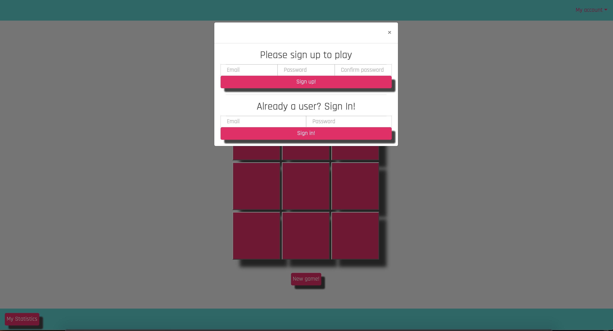
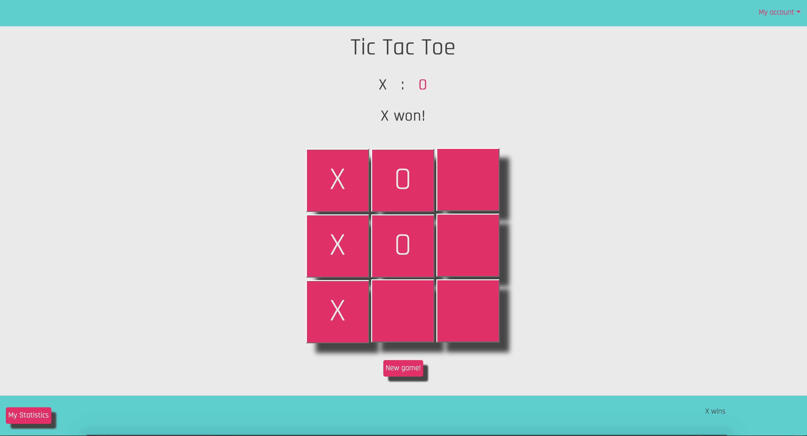
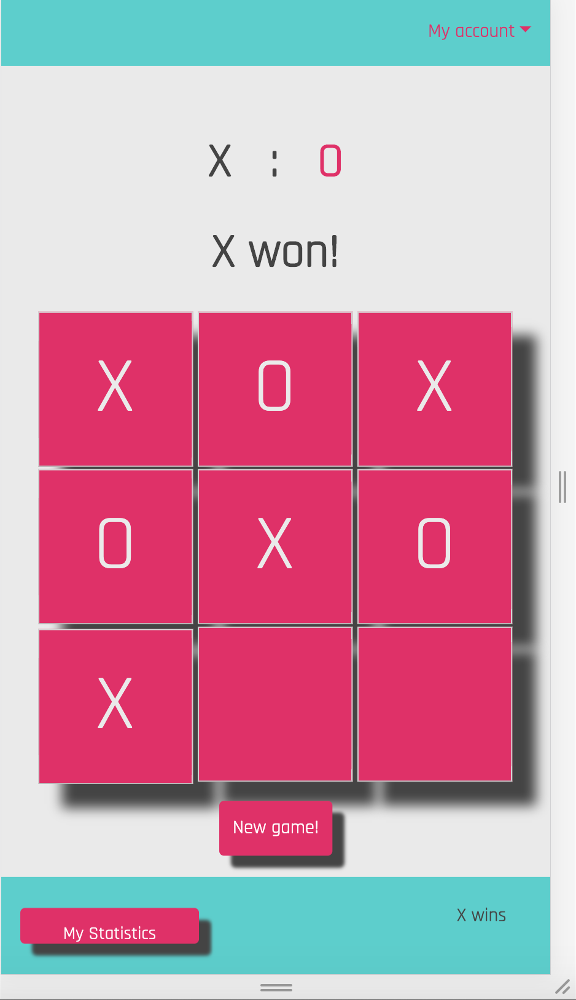
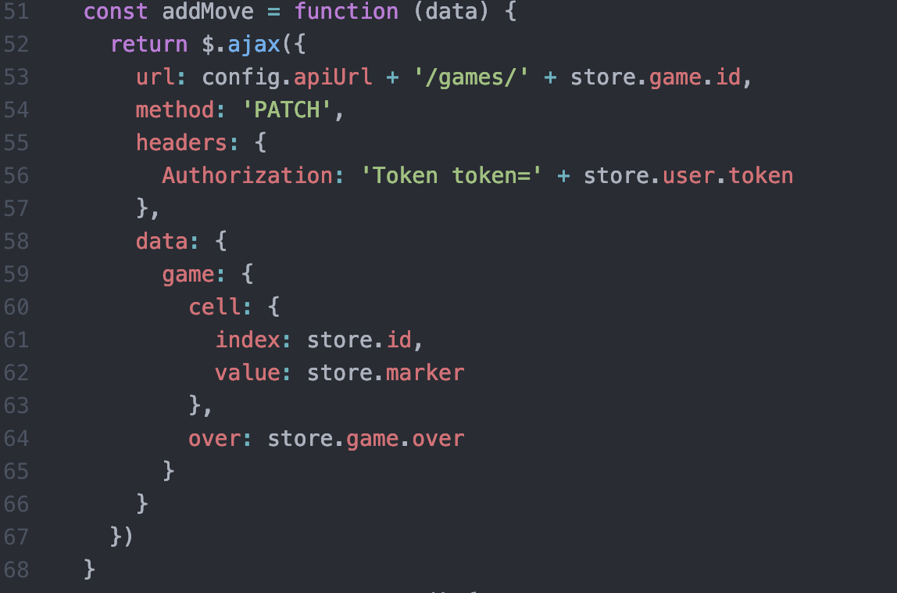
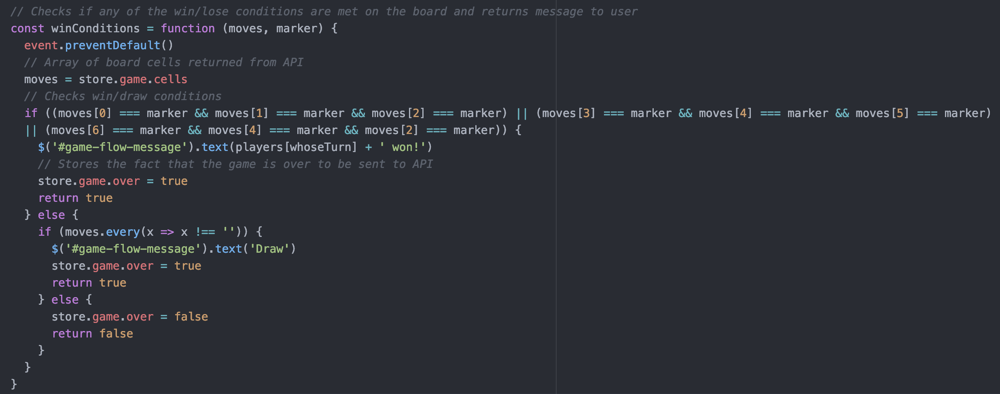

# Tic Tac Toe Game Project

# Project Description
This project is a browser Tic Tac Toe game. The goal of the project is to build a dynamic web application using the most resent front-end and back-end technologies.

## Table of contents
* [Development process](#development-process)
* [Screenshots](#screenshots)
* [Technologies](#technologies)
* [Features](#features)
* [Status](#status)
* [License](#license)
* [Contact](#contact)

## Development process
The development process can be divided in 2 steps:

### Step 1: Brainstorming and development
I started with writing a user`s story and defining problems that the app will have to solve on the way.
Then I draw a wireframe to define the essential elements on the page.
Link to the wireframes and user stories: https://docs.google.com/document/d/17Ljy7tNepP2svTX7HHVXlsnsX7Bu4z7YkCUT_zv3tXM/edit?usp=sharing

The next step was breaking the entire app process into small manageble problems and describing the solution in plain English.
Example:
* If I click on the cell 1X1, that and text 'X' to the cell and add value 'X' to the cell`s index in the game board array in JS.
* If cells 1X1, 2X2 and 3X3 contain the same value 'X', then stop the process and print a message 'X won'.

### Step 2: Coding

I started with the api calls that the app will have to run. First, I wrote and tested curl scripts to check in the api returns the data that I need it to return. Then, based on the curl requests` logic, I wrote ajax requests that were triggered by the user interacting with various elements on the page.
Example: User clicks on the 'New Game' button, triggeres the function that crates a new game object in API.

With all the API interaction working, I moved to creating basic page layout in HTML.

After that, I developed the game engine with JavaScript. The JavaScript functions are also triggered by user interacting with the elements on the page.

The next step was testing the app and making sure all the features were working properly.

The last step was styling with Bootsctrap, SASS and CSS.

## Screenshots

## Technologies
Project created with:
* HTML5
* CSS3
* JavaScript ES6
* Bootstrap 4
* SASS 1.22.10
* Ajax
* jQuery 3.4.1

## Code Examples

## Features
List of features ready and TODOs for future development
* SPA: the app does not require refreshing the page in any case, that significantly improves user`s experiemce.
* Store data: the app keeps the user`s data and allows access to the user's statistics.
* Responsive design: allows the user to experience full functionality on mobile devices.

To-do list:
* Add AI: create a feature that would allow the user to play against a computer.
* Add multyplayer: allow different users to compete against from different devices.

## Status
Project is in progress.
Continue adding new features.

## License

This project is licensed under the terms of the MIT license. See the LICENSE file for details.

## Contact
Created by Elina Gorshkova(https://github.com/elinagorshkova, https://www.linkedin.com/in/egorshkova/) - feel free to contact me!
